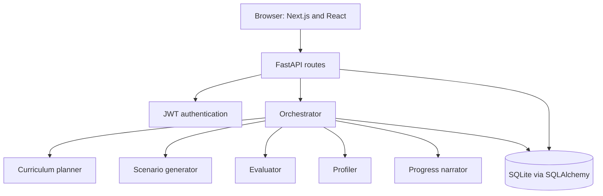

# CyberShield

### Adaptive cybersecurity training with coordinated AI agents

**Agentic AI Hackathon ? Indian Institute of Technology Bhubaneswar**

CyberShield is a browser-based training prototype for practising defensive cybersecurity decisions. Learners work through simulated incidents, compare four possible actions, receive explained feedback, and review their progress across sessions.

A central orchestrator coordinates five specialist agents for curriculum planning, scenario generation, evaluation, learner profiling, and session debriefs.

[Presentation](docs/presentation/CyberShield_IIT_Bhubaneswar.pptx) ? [Architecture](docs/architecture.md) ? [Deployment guide](deployment/README.md) ? [Demo walkthrough](docs/demo-guide.md)

## Submission materials

| Requirement | Deliverable |
|---|---|
| Problem & Solution Brief | [Project brief](docs/problem-and-solution.md) |
| System Architecture / Workflow | [Architecture and workflow](docs/architecture.md) |
| Source Code / GitHub Repository | The backend and frontend in this repository |
| 3?5 minute Demo Video | [Presentation with embedded preview and recording plan](docs/presentation/README.md) |
| Runnable or Deployed Version | [Local setup](#quick-start) and [Docker deployment](deployment/README.md) |

**Video status:** the presentation includes the original 54.5-second preview. A full 3?5 minute recording remains to be added. **Hosting status:** the [Vercel frontend](https://cybershield-azure-delta.vercel.app/) is online. The Render backend and live AI connection still require deployment and verification. Follow the [Render + Vercel guide](deployment/render-vercel.md).

## What the application does

- Registers learners as students, professionals, or enterprise users.
- Provides topic selection across ten cybersecurity domains.
- Plans training sessions and presents incidents with four defensive choices.
- Returns a verdict, XP change, explanation, and improvement tip after a response.
- Stores skill profiles, responses, session history, and progress summaries.
- Supports pause, resume, and early termination of training sessions.

The incidents are simulations. CyberShield does not monitor or modify real networks.

## Agent architecture



| Component | Responsibility |
|---|---|
| Orchestrator | Coordinates the session and persists training changes |
| Curriculum planner | Selects the session topic sequence and training focus |
| Scenario generator | Produces simulated incidents and four response choices |
| Evaluator | Explains the chosen action and assigns a verdict and score |
| Profiler | Maintains topic skills and decision patterns |
| Progress narrator | Produces the session debrief |

The planner builds the session plan from the learner profile and selected topics. After each response, the evaluator and profiler update the learner state. The orchestrator advances through the plan and generates the next scenario or a closing narrative.

## Technology

| Layer | Implementation |
|---|---|
| Interface | Next.js 15, React 18, Tailwind CSS, Recharts, Axios |
| API | Python, FastAPI, Pydantic |
| Persistence | SQLAlchemy and SQLite |
| Authentication | JWT and bcrypt, with optional Google OAuth |
| Live AI integrations | Anthropic and optional Gemini for scenario generation |
| Deployment | Vercel frontend + Render backend; Docker Compose also supported |

## Quick start

### Requirements

- Python 3.11 or newer. Backend workflow verification passes on Python 3.11.11 (the Render target).
- Node.js 20.9 or newer and npm. Local verification used Node.js 24, while CI and the frontend container use Node.js 22.
- Internet access for the initial dependency installation.

The frontend `.npmrc` preserves the peer-dependency resolution used for the lockfile, including in CI and Docker.

The default demo requires no API keys. It uses the application's built-in fallback content. Live AI mode is optional.

### Windows PowerShell

Clone the repository and install dependencies:

```powershell
git clone https://github.com/Risikesh2006/cybersheild-1.git
cd cybersheild-1
powershell -ExecutionPolicy Bypass -File scripts/Setup.ps1
```

Start the backend in one terminal:

```powershell
powershell -ExecutionPolicy Bypass -File scripts/Start-Backend.ps1
```

Start the frontend in a second terminal:

```powershell
powershell -ExecutionPolicy Bypass -File scripts/Start-Frontend.ps1
```

| Service | Local address |
|---|---|
| Application | http://localhost:3002 |
| API health | http://localhost:8001/health |
| API documentation | http://localhost:8001/docs |

Register a fresh account, choose Network Security and Endpoint Security, and begin a session. Stop each server with Ctrl+C.

### macOS / Linux

```sh
python3 -m venv .venv
. .venv/bin/activate
python -m pip install -r backend/requirements.txt
cd frontend
npm ci
cd ../backend
FRONTEND_URL=http://localhost:3002 python -m uvicorn main:app --host 127.0.0.1 --port 8001
```

In another terminal, from the repository root:

```sh
cd frontend
NEXT_PUBLIC_API_BASE_URL=http://localhost:8001 npm run dev -- --port 3002
```

## Demo and live AI modes

| Mode | Configuration | Behavior |
|---|---|---|
| Local demo | `DEMO_MODE=true`, the default | Uses fallback scenarios and feedback without external AI calls |
| Live AI | `DEMO_MODE=false` with private provider keys | Uses configured model providers, with fallback behavior on failure |

For local live mode, copy `backend/.env.example` to `backend/.env` and set your own values. Anthropic supplies the planner, evaluator, profiler, and narrator. Scenario generation prefers configured Gemini, otherwise Anthropic. Provider availability and model access depend on your account.

| Variable | Purpose |
|---|---|
| `DEMO_MODE` | Enables the credential-free fallback workflow |
| `SECRET_KEY` | JWT signing secret, required in production |
| `ANTHROPIC_API_KEY` | Private Anthropic credential for live mode |
| `GEMINI_API_KEY` | Optional private Gemini credential |
| `CLAUDE_MODEL` | Model used by Anthropic specialist agents |
| `CLAUDE_SCENARIO_MODEL` | Anthropic scenario-generation model |
| `GEMINI_SCENARIO_MODEL` | Gemini scenario-generation model |
| `DATABASE_URL` | SQLAlchemy database connection |
| `FRONTEND_URL` / `CORS_ORIGINS` | Frontend origin and allowed browser origins |
| `GOOGLE_CLIENT_ID` / `GOOGLE_CLIENT_SECRET` | Optional Google OAuth configuration |

A missing development signing secret generates a process-local value, so restarting the backend signs users out. Production rejects missing or unsuitable signing secrets. Keep a private, stable, randomly generated secret for deployed sessions.

## Deployment

The repository contains production Dockerfiles, health checks, persistent database storage, and a Caddy gateway that exposes the frontend and `/api` under one address.

1. Install Docker Engine and Compose v2 on the deployment host.
2. Copy the root `.env.example` to `.env` and set a unique random `SECRET_KEY`.
3. Run `docker compose up --build -d` from the repository root.
4. Open http://localhost and verify http://localhost/api/health.

For a public domain, configure `PUBLIC_URL` and `SITE_ADDRESS` as described in the [deployment guide](deployment/README.md). The configuration targets a single Docker host with a persistent SQLite volume.

**Verification boundary:** Docker was unavailable on the preparation workstation. Container startup and HTTPS still require target-host verification. CI now includes a container integration job, whose result should be checked in [GitHub Actions](https://github.com/Risikesh2006/cybersheild-1/actions).

## Verification

With backend dependencies installed:

```sh
python scripts/verify_demo.py
```

On Windows, use `.venv/Scripts/python.exe scripts/verify_demo.py` if the virtual environment is not activated.

The script uses a temporary database and randomly generated credentials to check registration, login, topic selection, session start, pause, resume, submissions, completion, debriefs, history, progress, and early termination. It does not call AI providers or modify the normal training database.

Build the frontend with:

```sh
cd frontend
npm run build
```

See [verification notes](docs/verification.md) and the [CI guide](docs/CI_README.md) for the checks and their limits.

## Repository structure

```text
backend/
  agents/          Orchestrator and five specialist agents
  models/          Database models
  routes/          API endpoints
  schemas/         Request and response validation
frontend/
  src/app/         Next.js routes
  src/views/       Page components
  src/context/     Authentication and session state
  src/services/    API client
deployment/        Caddy configuration and hosting guide
scripts/           Setup, launch, and isolated verification
docs/              Project brief, architecture, demo guide, presentation
compose.yaml       Container service configuration
```

## Credential handling

Never commit API keys, passwords, tokens, private keys, environment files, or user databases. Git and Docker ignore rules exclude private runtime files. The committed environment templates contain empty credential fields.

The submission scan checked known local credential values and common token patterns. It is not a comprehensive audit of the application's security or all historical commits. Store any database backups privately.

## Project status

This is a hackathon training prototype. The credential-free workflow and frontend production build have passed local checks. Live provider inference, Google OAuth, educational effectiveness, and production scalability have not been established by those checks. Some alternate profile components contain illustrative data.

Future work includes a complete demo recording, deployment-host validation, broader authorization testing, schema migrations, and instructor review of generated content.

## Team

Akshay Kumar N, Pranav Y, Rishikesh Somnath, and Lalith Kumaar S.

Prepared for the **Agentic AI Hackathon at the Indian Institute of Technology Bhubaneswar**.
