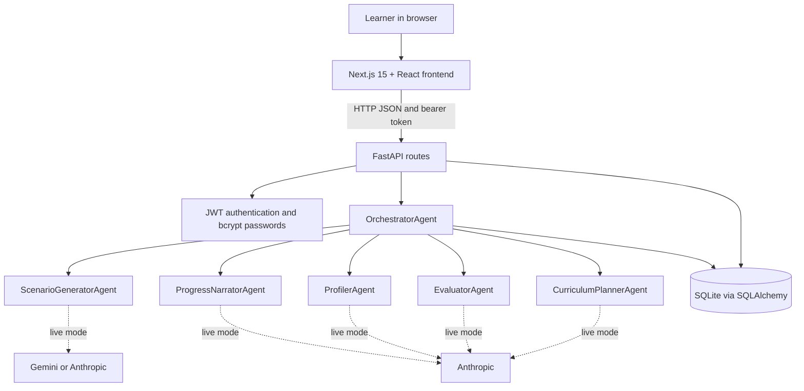
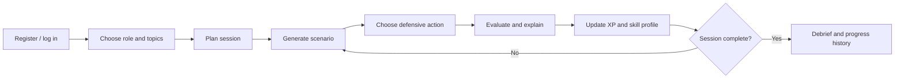

# 02 ? System Architecture / Workflow

## Component architecture

The browser renders the interface and calls the API through Axios. Authentication routes issue JWTs. Backend routes check access and delegate training operations to the orchestrator. SQLAlchemy persists users, profiles, topic selections, sessions, scenarios, responses, evaluations, and progress snapshots. The local database is created at startup and is excluded from the submission.

## Training workflow

Pause stores the current session state; resume returns the active scenario. Calling off a session ends it and generates a summary for work completed.

## Responsibilities and source mapping

| Component | Responsibility | Source |
|---|---|---|
| Frontend | Pages, authentication state, session state, API calls | `frontend/src/app`, `views`, `context`, `services` |
| API | Authentication, topics, sessions, submissions, progress | `backend/routes` |
| Orchestrator | Coordinates agents and persists training changes | `backend/agents/orchestrator.py` |
| Curriculum planner | Selects and sequences session topics | `curriculum_planner_agent.py` |
| Scenario generator | Produces a four-option defensive scenario | `scenario_generator_agent.py` |
| Evaluator | Verdict, score, explanation, and improvement tip | `evaluator_agent.py` |
| Profiler | Initial profile and updates after decisions | `profiler_agent.py` |
| Narrator | Session summary and learning feedback | `progress_narrator_agent.py` |
| Persistence | Relational models and database setup | `backend/models`, `database.py` |

## Key API flow

`POST /auth/signup` ? `POST /onboarding/topics` ? `POST /session/start` ? `POST /scenario/submit` ? `GET /progress/dashboard`.

Additional controls: `/session/pause`, `/session/resume`, `/session/calloff`; discovery: `/health` and `/docs`.

## Demo and live modes

The submission adds `DEMO_MODE=true` by default. This disables provider credentials in the process and uses existing fallback logic, without making AI requests. With `DEMO_MODE=false`, scenario generation prefers configured Gemini, otherwise Anthropic; other agents use Anthropic with fallback behavior on failure. Model identifiers in the source are configurable only where implemented and must be checked against the provider account before a live demonstration.

## Trust boundaries

Keep provider credentials and the JWT signing secret on the backend. The frontend receives a session token but must never receive provider secrets. The source snapshot excludes `.env`, existing database records, caches, installed dependencies, and Git history. This design description is not a claim of a completed security audit.
